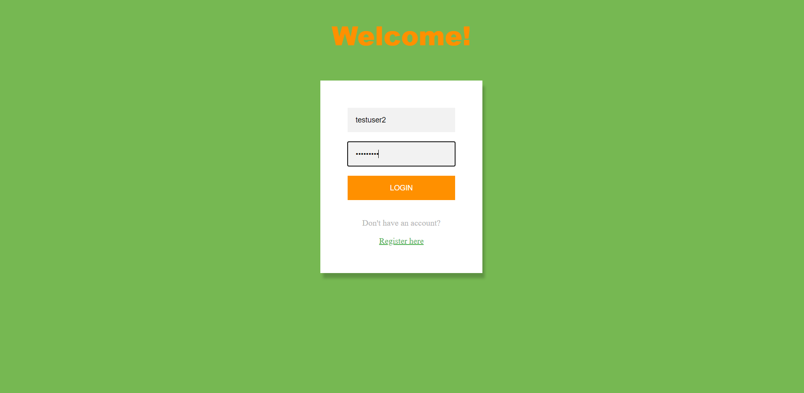
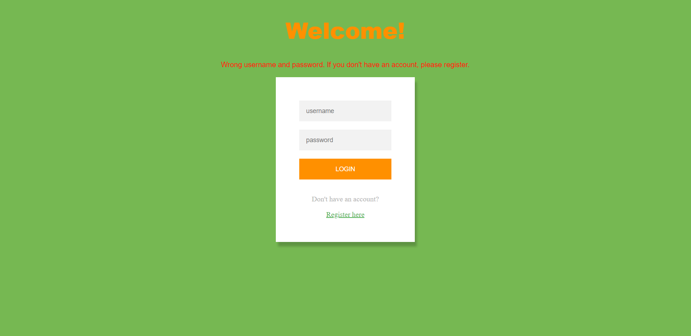
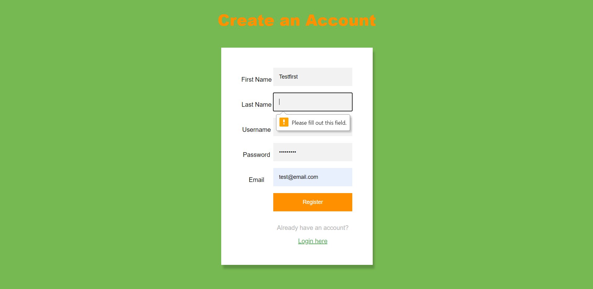
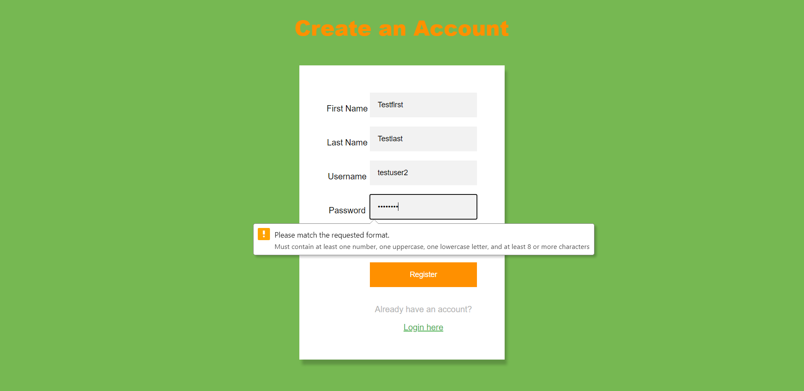
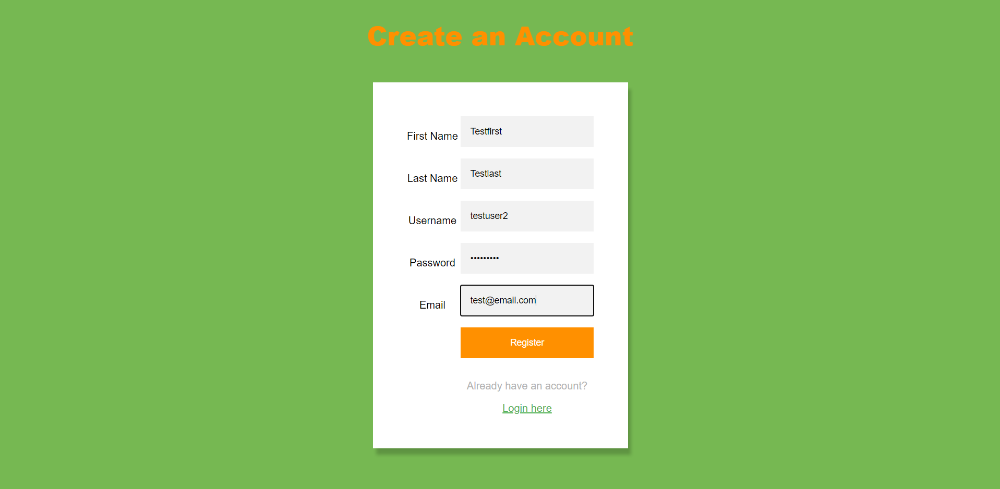
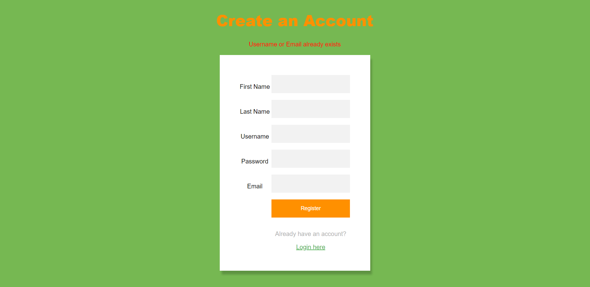
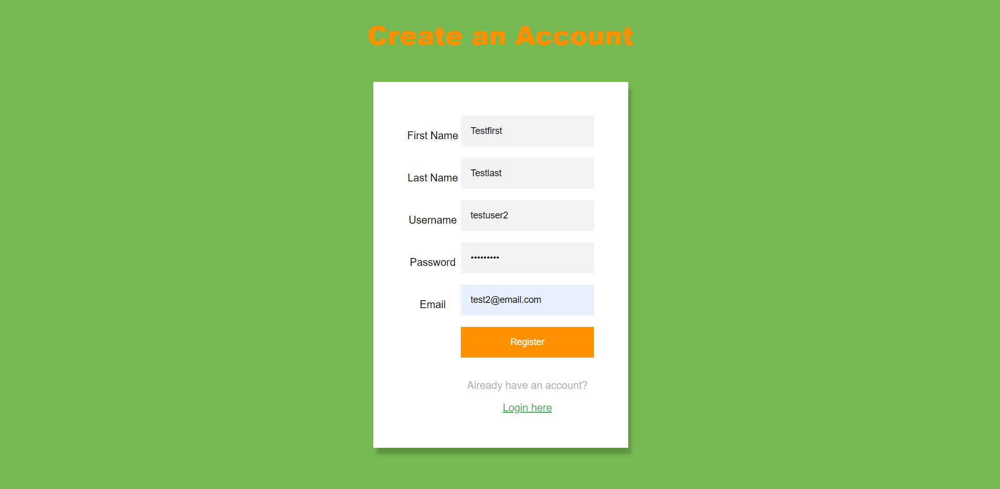
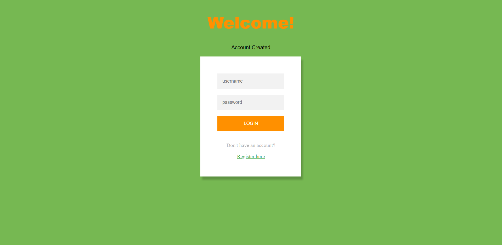
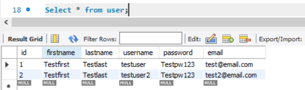
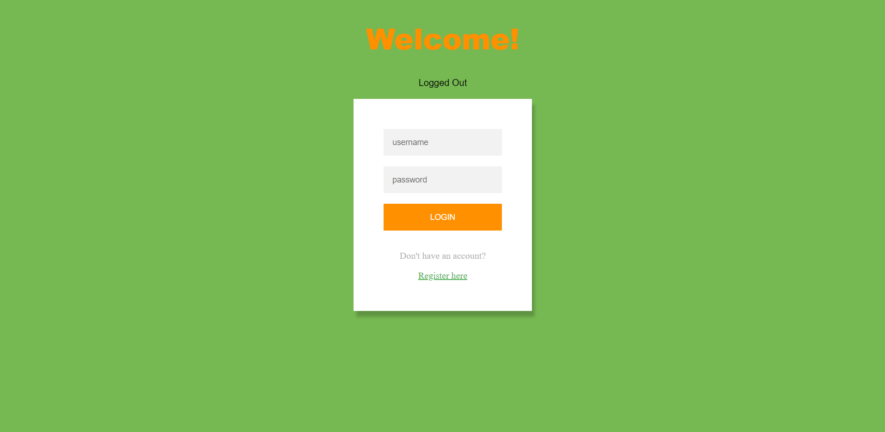

<h1 align="center">UserAccount</h1>

A simple User Account application with the ability to Register, Login, and Logout. Connected to a database that keeps track of user accounts. Some CSS was used for better UI and REGEX for validating registration.

### Built With

* Servlets
* JSPs
* SQL

## Setup

### Prerequisites

Softwares used and embedded links to how to install them.
* <a href="https://www.eclipse.org/eclipseide/">Eclipse</a>
* <a href="https://www.eclipse.org/webtools/jst/components/ws/M4/tutorials/InstallTomcat.html#:~:text=Start%20the%20Eclipse%20WTP%20workbench,under%20Apache%20(Apache%20Tomcat%20v5.">Apache Tomcat </a>
* <a href="https://ladvien.com/data-analytics-mysql-localhost-setup/">MySQL</a>

### Installation

1. Download project zip file, open zip folder, open UserAccount-master folder, extract UserAccount and open project folder in Eclipse
2. Right click project folder -> Properties-> Project Facets -> Convert to faceted form... -> Dynamic Web Module & Java -> Apply and Close
3. Right click project folder -> Build Path -> Configure Build Path... -> Classpath -> Add External JARs -> your Tomcat folder (ex: C:\Program Files\Apache Software Foundation\Tomcat 9.0\lib)-> servlet-api.jar -> Open -> Apply and Close
4. Create local connection on MySQL and open connection. Paste and run sql code.
5. Edit connection file (UserAccountConnection.java) password in Eclipse
6. Right click project folder -> Run As -> Run on Server -> Finish

## Demo

